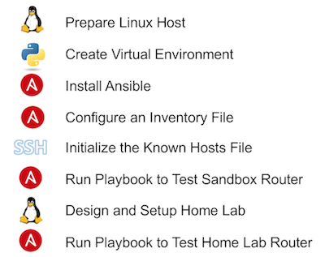

# Introduction

##  Objective

Completion Time: 30 minutes

By the end of this lab, you should be able to:

-   Describe how Ansible connects to networking devices using SSH to run Ansible modules using Python on your computer.
-   Install Ansible on your computer as a Python package using PIP
-   Verify Ansible works between your computer and a DevNet Sandbox router using a simple Ansible playbooks
-   Compare alternatives for how to connect your lab computer to both your home network and home lab so that you can run Ansible experiments with networking devices in your home lab
-   Verify Ansible works between your computer and networking devices in your home lab network

##   Prerequisites

To perform this DevNet Learning Lab, you need:

-   One physical or virtual instance of Linux in your home lab
-   Internet access from the Linux host
-   Ability to connect the Linux host to your home-based lab network as desired
-   Python, PIP, and virtual environments installed on the Linux host (as discussed in earlier labs in this same DevNet Learning Module)

##  Intro

Ansible is a configuration management and orchestration tool, a tool that can be for a variety of purposes, including managing servers as well as for managing networking devices. It has the same overall purpose as some other configuration management tools, like Puppet, Chef, and Salt.

To better understand Ansible, think about how it was first used to manage large groups of servers. The automation or server administrator can use Ansible on their desktop OS, as shown on the left side of the figure. Various Ansible files (configuration files, inventory files, and playbooks, among others) define the settings and logic so that Ansible knows which of the servers need to be changed, and what specific settings each needs to use. To scale, the architecture uses the concept of an Ansible Control Server (ACS), which can do some of the processing, eventually sending Python code to the various servers. The servers, with Python installed, run the Python code to implement the changes, reporting back status information.

The figure shows several important points that carry over to how Ansible is used with networking devices. First, Ansible uses SSH as a transport. Second, notice that the device being managed – Linux servers in this case – do not have any Ansible code installed, instead implementing changes by running Python programs and communicating with SSH. The Ansible code first runs on the admin’s desktop OS, with some functions run on a separate Ansible Control Server. As a result, Ansible is considered agentless, that is, there is no Ansible agent (service) needed on the servers being managed.

With networking devices, the Ansible architectural model must change a little, because most networking devices cannot run Python code (although that fact is changing over time). Instead, to manage networking devices, Ansible uses the following model:

-   Rely on SSH on the networking device, but do not rely on running Python on the device
-   Use CLI commands, or possibly some API on the device (e.g., NETCONF/YANG), to extract configuration and operation data
-   All Ansible and Python code, to perform logic and set values, must occur outside the managed device

##  Ansible in This DevNet Learning Lab

This lab focuses on running Ansible on your computer. However, this lab covers a specific case: using a Linux host as your desktop OS, with running the Ansible Control Server function on that same Linux host.

As for the ACS, Ansible allows you to run the ACS on a separate server or locally on the same computer as where you issue the Ansible commands, and for most networking automation, you can just run the ACS locally. As for using Linux instead of Windows, although [Ansible support the function of managing Windows hosts](http://docs.ansible.com/ansible/latest/intro_windows.html), using Windows as the ACS requires more work to set up the environment. As a place to get started (which is one goal of this lab), and given Ansible’s history of growing up in a Linux environment, this DevNet Learning Lab includes Linux as the only desktop OS options. This lab exercise expects you to either use a computer that runs Linux natively, or install a Linux desktop virtual machine.

This DevNet Learning Lab also covers a rather long set of separate topics. The overall goal is to get Ansible working on your Linux host, with each step building towards the steps that run an Ansible playbook to prove Ansible is working. The roadmap shown in the next figure shows the major steps in this lab:

##  Lab Context: DevNet Learning Tracks and Modules

This final lab in the “[Home Lab: Setting up Your Desktop OS for Network Programmability](https://learninglabs.cisco.com/modules/home-lab-desktop)” Learning Module, like the other labs in this module, focuses on your Desktop computer’s OS. In this case, the end goal is to make your desktop OS ready to do lab experiments with Ansible. And as with the other labs in this module, the goal is to slow down, think about the tools, and make sure you are ready to work with the technology independently from your workstation. In sequence, this lab sits in the fifth position in its Learning Module, as show in this figure:

