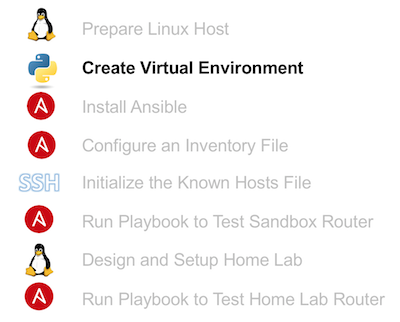
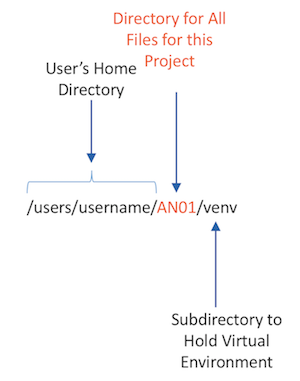
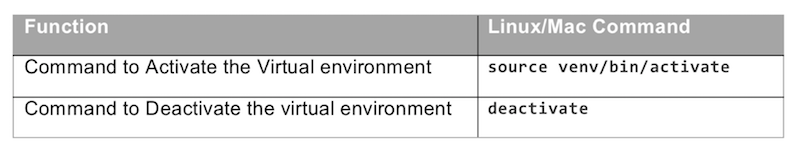

# Prepare a Python 2.7 Virtual Environment

This next page looks at the Python version and environment you might want to use to run Ansible. By working through the steps on this page, you will consider your options for which version of Python code to use, and create a Python virtual environment using Python 2.7. (If you choose Python 3.x, the next page in this lab works through the steps with you.)

Note that all lab steps show Linux as your desktop OS.

## Choose Which Python Version/Release to Use

For most people today, you can choose to use Ansible with either Python 2.7 or the two most recent Python 3.x version (Python 3.5 and 3.6). Ansible version 2.2 added [support for Python 3.x](http://docs.ansible.com/ansible/latest/python_3_support.html) (namely, Python 3.5 and later). However, because much of the core Ansible code and Ansible modules are written in Python, the combination of Python version/release and Ansible version/release may uncover issues. Using Python 2.7 may be safer than using 3.5 or 3.6, just because Ansible users have had longer to use and uncover issues using Ansible modules with Python 2.7 compared to Python 3.x. Summarizing some of the decision points:

-   You can get started with either Python 2.7 or Python 3.5/3.6
-   If using Python 3.x, it must be 3.5 or later
-   Using a virtual environment helps for many reasons, including the fact that no matter which Python version, will make it easier to later update to some other version of Python
-   If you want to be most careful, use Python 2.7 over Python 3.5/3.6.

The exercise steps on this page guide you to set up a virtual environment for Python 2.7 for use with Ansible. However, if you have chosen to use Python 3.x, you can easily do so with the steps in this lab. To use your Linux system’s default Python version 3, use the same steps listed on this page, but substitute the following:

-   For each command that begins **python**, use **python3** instead.

## A Few Notes about Virtual Environments for Ansible

Virtual environments provide many useful features, and it can be a good habit to use a virtual environment for each project. This lab shows the creation and use of a virtual environment that is used throughout this lab, added to a subdirectory named AN01 (shorthand for Ansible lab 1), as shown in the next figure.

You may of course choose to not use a virtual environment, but the lab steps assume the use of the virtual environment as shown here. Check out the second lab in the “[Home Lab: Setting up Your Desktop OS for Network Programmability](https://learninglabs.cisco.com/modules/home-lab-desktop)” Learning Module, for the lab about PIP and virtual environments, for more background info.

## Install/Refresh the Virtualenv Package with PIP

Just to make sure that no matter where you begin, you can create the virtual environment, this next set of steps walks through the process of installing (or refreshing the installation of) the virtualenv package. This section assumes you have Python 2.7 and the associated PIP already installed. To (re)install the virtualenv tool for Python 2.7:

1.  From your Linux desktop, open a new command shell.
2.  Confirm again your default Python 2.7 release and PIP version with these commands:
  -   **python -V **
  -   **pip -V**
3.  Call PIP to install the virtualenv tool: **sudo -H pip install virtualenv**
4.  Confirm that the virtualenv tool is installed, and can be called from Python 2.7, with this command: **python -m virtualenv --version**
5.  Leave your command shell open.

At this point, you should be ready to create the virtual environment.

## Create the Virtual Environment

Next, create a virtual environment to use for this lab. (This step assumes the virtualenv tool is ready to use, from either before you began lab, or per the previous steps on this page.) With these steps, you will create one new /AN01 subdirectory off your home directory, as a project directory for this lab project. You will then add a /venv subdirectory in which to create the virtual environment, as shown in the following figure.

Under those assumptions, follow these steps to create and activate the virtual environment:

1.  Open a new command shell.
2.  If not already there, move to your home directory using this command: **cd ~**
3.  Confirm your current directory: **pwd**
4.  Create (make) the new lab exercise project directory: **mkdir AN01**.
5.  Move to the AN01 subdirectory as the current directory with the **cd AN01** command.
6.  Create the virtual environment into the “venv” subdirectory: **virtualenv venv**
7.  Leave the command shell open.

## Activate and Use the Virtual Environment

At this point, the virtual environment exists, ready for you to activate, install libraries with PIP, run Python within the environment, and so on. This last part of the page works through those last steps.

Follow these steps to activate the virtual environment. Note that you would use the same steps each time you want to reactivation and use the virtual environment.

1.  Continue using the same command shell, or open a new one as needed.
2.  Ensure you are in the /AN01 subdirectory off your home directory. To be sure, use these two commands:
  -   **cd ~/AN01**
  -   **pwd**
3.  Activate the virtual environment by executing the “activate” script in the virtual environment’s directory, using the appropriate command from the following table. The commands assume the virtual environment installed in the /venv subdirectory.

4.  To confirm the version of Python that you will use with this virtual environment, find the directory from which your OS would run the Python interpreter with this environment activated, which is the first directory listed in the output of this command: **which python**
5.  Leave the command shell open for now. However, when finished with the virtual environment at any time, just close the command shell, or use the commands in the table to deactivate it. When you return, repeat the steps in this sequence to reactivate it.

The next image shows an example of following the same steps:

> Note: You can activate the virtual environment no matter the current directory of the command shell. The above steps list specific directories just to make sure the navigation is clear
