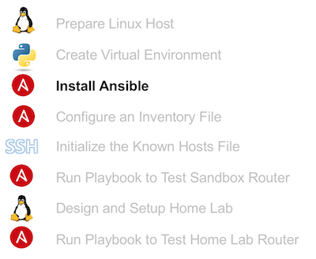
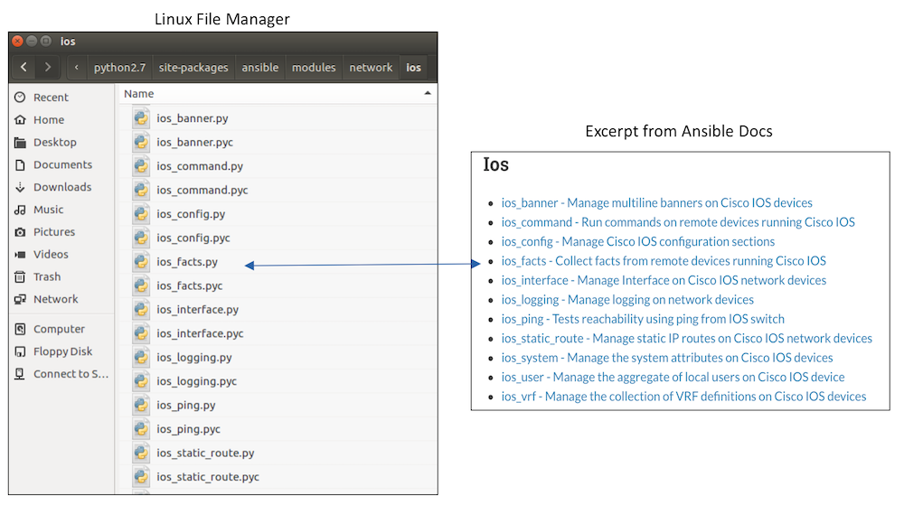
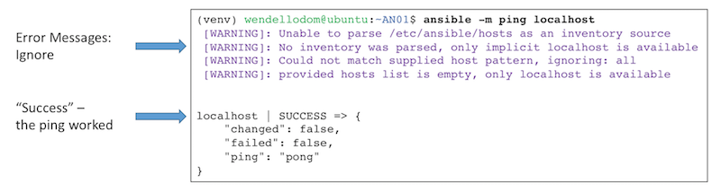

# Installing Ansible on your Desktop OS

From one perspective, Ansible is an agentless configuration management tool, which provides a domain specific language (DSL), and is used to automate the configuration and operation of IT resources. From another perspective, Ansible is also a Python application, existing as a set of Python modules, packaged so that it can be installed with PIP. All you need to do to install Ansible is to use the usual **pip install** command, as discussed on this page. The next figure puts this page’s step into context with the other steps in this lab.



## Install Ansible with PIP

Next, use PIP to install Ansible into your virtual environment, as follows:

1.  Return to the same command shell. It should have a current directory of your project directory, with your virtual environment activated. If you already closed it, open a new command shell, move to the AN01 project directory (**cd ~/AN01**), and activate your virtual environment (**source venv/bin/activate**).
2.  List the files in the venv/bin subdirectory with this command: **ls -l venv/bin**
3.  Note the absence of any commands that begin with “ansible” in that directory.
4.  Install Ansible using PIP: **pip install ansible**. (Do NOT use the **sudo** command before the **pip** command; doing so would install Ansible using PIP in the global environment, rather than the virtual environment.)
5.  Look at the messages displayed during the PIP installation of Ansible, looking for the other packages installed as a result. You should see PyYAML, paramiko, and jinja2, among others.
6.  Use the **pip list** command to list the installed libraries, checking to see Ansible is installed.
7.  List the files in the venv/bin subdirectory again; note that in this case, there should be a variety of files that begin with “ansible”.
8.  Keep the command shell open.

## Verifying the Ansible Installation

Next, take a few minutes to try to use a few Ansible commands. Seeing an Ansible command work from your virtual environment verifies that you should be able to use the commands once you learn more about Ansible. These next steps show you the Ansible version, and reveal some information about where Ansible installed the files.

1.  Move to the same command shell you were using at the end of the previous lab steps. If you already closed it, open a new command shell, move to the AN01 project directory (**cd ~/AN01**), and activate your virtual environment (**source venv/bin/activate**).
2.  List the version of Ansible you just installed with the **ansible --version** command.
3.  Examine the output of the **ansible --version** command to find the directory listed as the “Ansible Python module location”. The listed directory is where PIP installed the Ansible modules, and where the Ansible commands will look for modules. It should look something like the excerpt shown below.
```
ansible python module location =
/home/wendellodom/AN01/venv/local/lib/python2.7/site-packages/ansible
```
4.  Using a file manager, examine the files in the directory you found in the previous step, and compare the files to the list of Ansible modules listed in the [Ansible documentation](http://docs.ansible.com/ansible/latest/index.html). For instance, look for networking modules, and then modules for IOS. You should be able to find the same Ansible modules in the Ansible documentation, with the same categories, as found within this directory structure.

5.  As an example, keep using your file manager to find this subdirectory off AN01/venv: “./ lib/python2.7/site-packages/ansible/modules/network/ios”. Note that the modules have a file type of .py, confirming that the modules are written in Python. The next figure highlights one of those modules, ios_facts, which is used later in this lab.


6.  Move back to the same command shell that is running your virtual environment and has a current directory of /AN01.
7.  Issue the **ansible -m ping localhost** command. This command uses a name “localhost”, which references the loopback address (127.0.0.1), and the Ansible ping module. At this point, you will see some error messages because you have not yet created an inventory file in the default location. However, the end of the output should show a successful ping of your local host. The next figure shows a sample:


8.  Keep your command shell open.

At this point, you should be confident that you can call Ansible commands from your virtual environment. The next few pages together show enough detail so you can use a basic sample Ansible playbook to connect to a router in a DevNet Sandbox, first by creating and editing some values in an Ansible inventory file.
