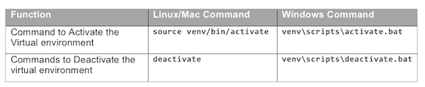

# Test the Python ncclient Library from Your Computer to the Sandbox

DevNet supplies some sample code along with the always on [NETCONF/YANG and RESTCONF on IOS XE](https://devnetsandbox.cisco.com/RM/Diagram/Index/27d9747a-db48-4565-8d44-df318fce37ad?diagramType=Topology) DevNet Sandbox, and those sample programs use a NETCONF Python library called ncclient. This next page works through the steps to run one of the sample programs, focusing on the underlying ncclient library as a tool.
## ncclient Basics

As is frequently the case, most anything you might want to do in programming might be done by using an existing library. [Ncclient](http://ncclient.readthedocs.io/en/latest/index.html) (NETCONF client) resides on the same computer as your Python code. Your program can make much simpler calls to the modules supplied by ncclient, rather than sifting through such details as XML schemas, NETCONF RPC methods, and SSH connection management.


One proof of the power of ncclient is that you can take the sample code available in the sandbox, and run it on your computer, with little or no knowledge about how NETCONF/YANG works, and still get the basic idea of what the sample code does for you. And as it turns out, running that sample code is a good final step to prove that you are ready to get started learning the details of NETCONF/YANG.

## Exercise: Python Library Installation and Verification

The sample programs available with the always on [NETCONF/YANG and RESTCONF on IOS XE](https://devnetsandbox.cisco.com/RM/Diagram/Index/27d9747a-db48-4565-8d44-df318fce37ad?diagramType=Topology) DevNet Sandbox have a few dependencies that require a PIP installation. The following steps guide you through the process, and assumes you need to re-activate your virtual environment from earlier in the lab. If you still have that virtual environment activated, you can skip straight to the first **pip** command in the below steps.

1.  Open a command prompt (or use the existing one).
2.  Change directories to move to the project directory for this lab (NC01). For instance, use the **cd NC01** command from your home directory.
3.  Activate the virtual environment by executing the **activate** script in the virtual environment’s directory, using the appropriate command from the following table. The commands assume the virtual environment installed in the /venv subdirectory.


1.  Use PIP to install ncclient along with the argparse library as well. Note that with the virtual environment activated, PIP will install ncclient into the Python Library path for that virtual environment, rather than the global environment. To do so:

  -   **pip install ncclient**
  -   **pip install argparse**

1.  Confirm details about the packages, including the documentation for each, using the **pip show ncclient** and **pip show argparse** commands.

## Exercise: Using ncclient

Next, let’s download the DevNet Sandbox sample code from GitHub, place one program in your NC01 directory (just to make describing the steps a little easier), and after making a few simple edits, run the program.

First, to download, place, and edit the program:

1.  Web browse to the always on [NETCONF/YANG and RESTCONF on IOS XE](https://devnetsandbox.cisco.com/RM/Diagram/Index/27d9747a-db48-4565-8d44-df318fce37ad?diagramType=Topology) Sandbox.
2.  Find the list of sample programs, under the heading “Hello World”, and click the option for “Basic NETCONF Get”. This sample program gets the entire running config from a device. Clicking the link should open a browser tab to GitHub.
3.  Using any method you choose (download the entire GitHub repo, copy/paste the program from the web page, etc.), copy the program to your computer, into a file of the same name (NC-get-config.py), and place the file in the NC01 directory you set up as part of this lab.
4.  Edit the program to change one **print** command to work in Python 3.6 as well as Python 2.7. (The sample code uses a **print** statement with Python 2.7 syntax, but updating to the newer Python 3.x syntax will work when using either Python 2.7 or 3.x.) To make the change, look for the last line in the file, with a **print** statement without parentheses on the ends, and add parentheses. Use this sample for comparison.

```
# Old last line of program with no ()
print xmlDom.toprettyxml(indent="  ")
#
# New last line of program with added ()
print(xmlDom.toprettyxml(indent="  "))
```

Now you are ready to run the program in your virtual environment – just follow these steps:

1.  Move to the command shell in which you had already activated your virtual environment for this lab.
2.  Make sure your current directory is the NC01 subdirectory where you placed the program, and if not, change directories. (Use the **cd** and **pwd** commands as needed.)
3.  As an extra confirmation step, list the files in the directory that begin with NC:

  -   (Windows): **dir NC>***
  -   (Linux/Mac): **ls -l NC>***

4.  Run the sample python program with no parameters (**python NC-get-config.py**), which causes the program to provide some help text. That help describes how to pass the key parameters: hostname, username, password, and port number, as shown in this sample of the output:
```
usage: NC-get-config.py [-h] --host HOST [-u USERNAME] [-p PASSWORD] [--port PORT]
```
1.  Run the program again, passing the parameters for the IOS XE instance in the always on DevNet NETCONF/YANG and RESTCONF Sandbox. Assuming the values have not changed since this lab was published, the command will be:

  -   (Windows): **python NC-get-config.py --host ios-xe-mgmt.cisco.com -u root -p “D_Vay!_10&” --port 10000**
  -   (Linux/Mac): **python NC-get-config.py --host ios-xe-mgmt.cisco.com -u root -p 'D_Vay!_10&' --port 10000**

1.  Examine the XML data returned by the program. If you look past the XML tags, you should see many familiar commands. If you like, use SSH to login to the same XE instance directly, and use the **show running-config** command to list the configuration, comparing that output to the XML displayed by the sample program.

Congratulations! You have just used NETCONF/YANG from a Python program on your computer – you are ready to go forth and learn more!
